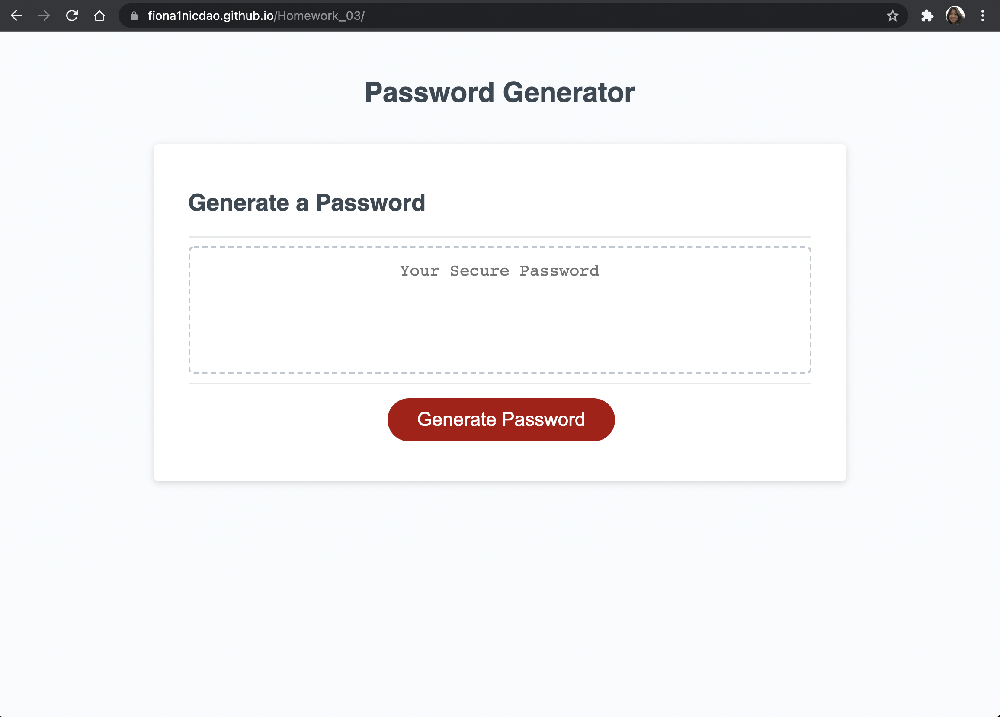
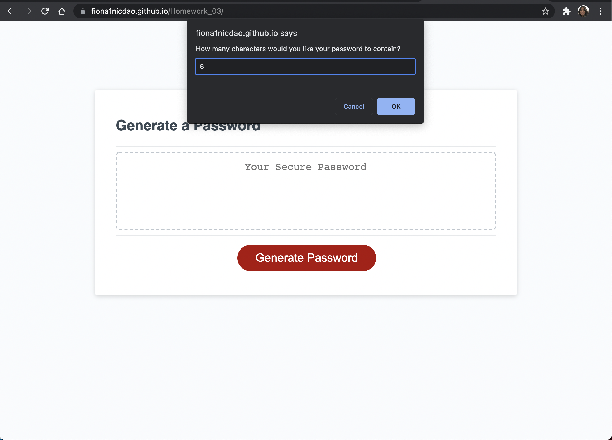
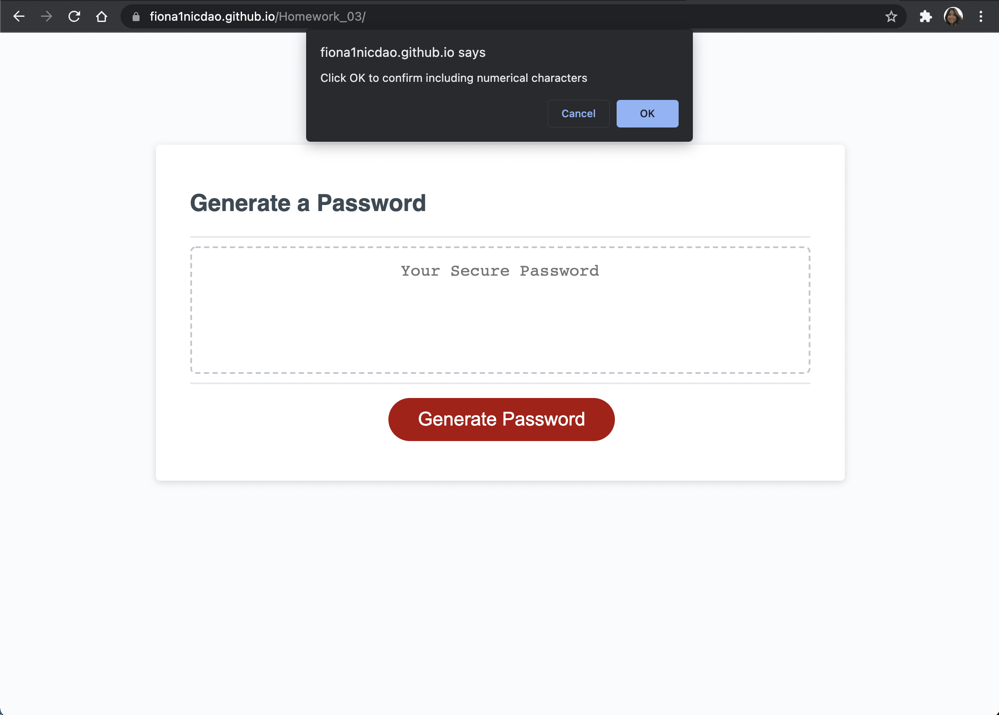
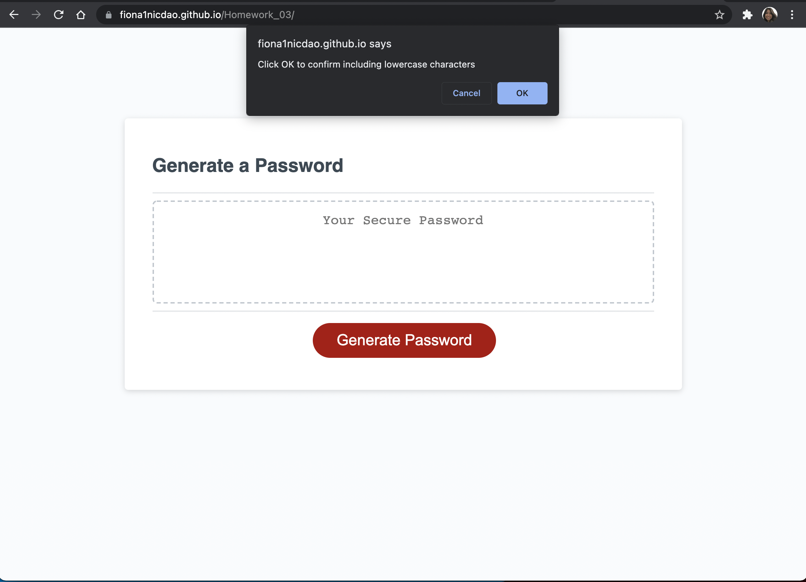
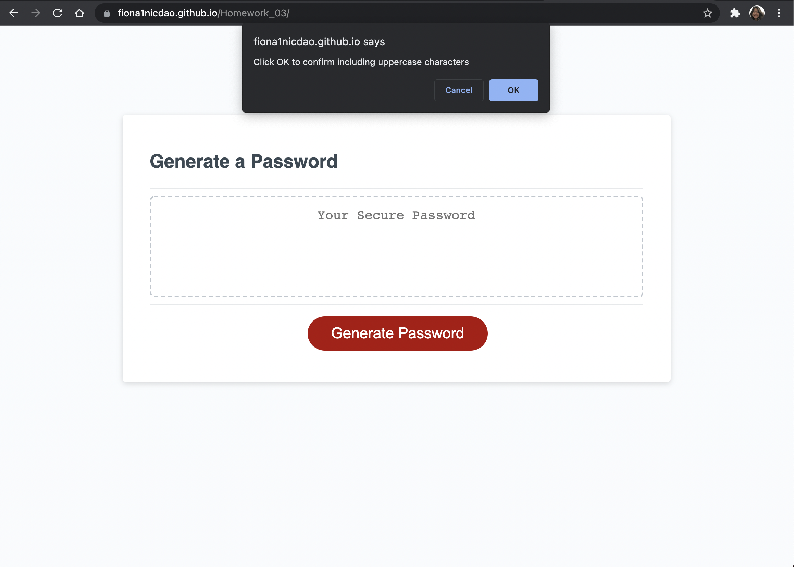
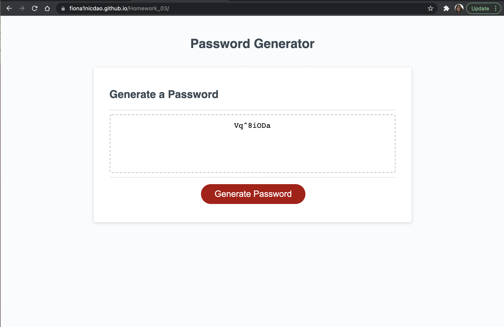

# Password Generator
# Week 3 JavaScript 

## Objectives 
- make a password generator 
- have prompts for password criteria 
- be able to select different criteria for password 
- criteria includes: lowercase, uppercase, numbers, special characters
- length of password must be between 8 and 128 characters 
- password must have at least one character type that was selected 
- passworld must be displayed on an alert or on the window page 

## Link to Password Generator 
Click on [webpage](https://fiona1nicdao.github.io/Password-generator/) to view. 

## Preview 

